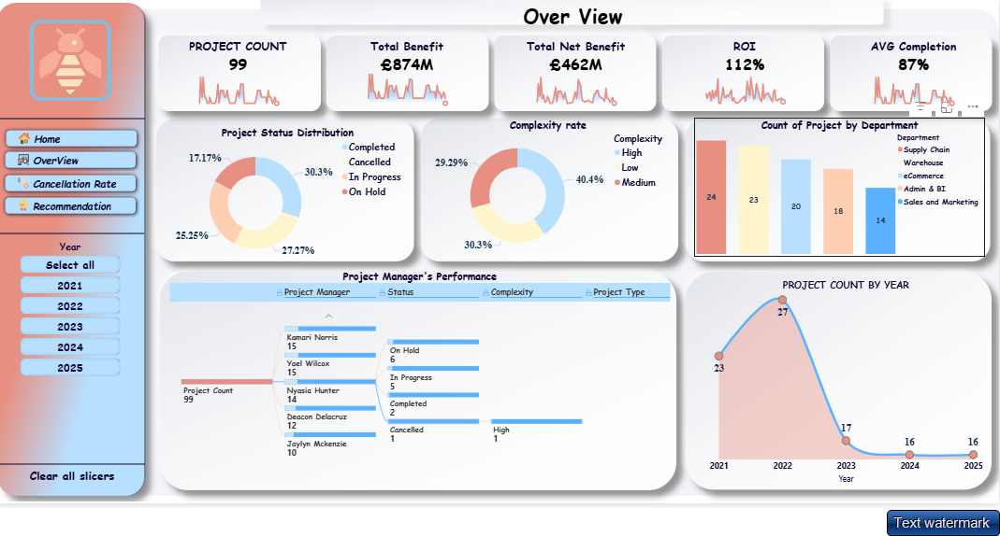
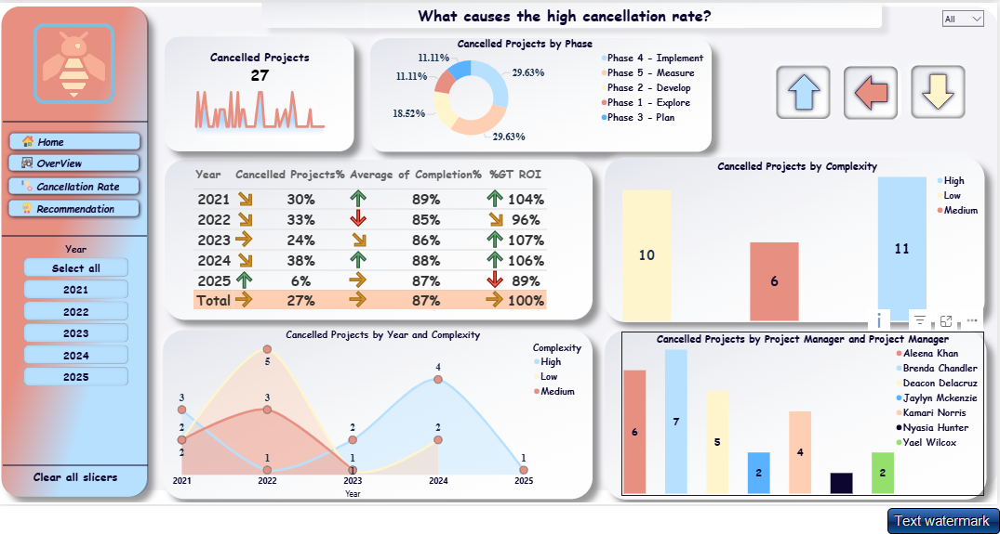
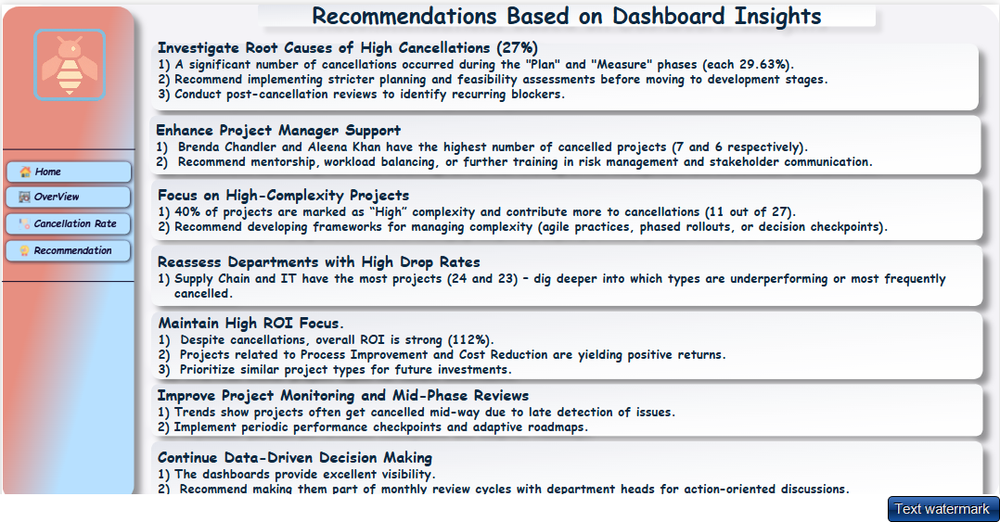

# ProjectPerformanceInsights

## Overview

This Power BI project presents a detailed analysis of a **project portfolio** to identify patterns, challenges, and opportunities for improvement based on key metrics such as project status, cancellation rates, ROI, complexity, and performance by department and project manager.

---

## Key Metrics

- **Total Projects:** 99
- **Total Benefit:** £874M
- **Net Benefit:** £462M
- **ROI:** 112%
- **Average Completion Rate:** 87%
- **Cancelled Projects:** 27 (27% of total)

---

## Insights

1. **High Cancellation Rate:**
   - 29.63% of cancellations occur in both "Plan" and "Measure" phases.
   - Highest cancellations linked to high-complexity projects (40%).
   - Managers Brenda Chandler and Aleena Khan have the highest cancelled projects.

2. **Performance by Department:**
   - Supply Chain and IT departments have the most projects.
   - ROI remains strong despite cancellations, indicating effective cost/benefit management.

3. **Trends by Year:**
   - Project counts peaked in 2022 and declined afterward.
   - Cancellation rate dropped significantly in 2025.

4. **Complexity Breakdown:**
   - 40.4% of projects marked as "High" complexity.
   - High complexity correlates with higher cancellation probability.

---

## Recommendations

1. **Investigate Root Causes of Cancellations:**
   - Focus on early phases (Plan/Measure).
   - Implement stricter feasibility checks and post-cancellation reviews.

2. **Support Project Managers:**
   - Offer mentorship, workload balancing, and risk training for underperforming PMs.

3. **Improve High-Complexity Project Handling:**
   - Develop management frameworks (Agile, phased rollouts, decision checkpoints).

4. **Reassess Departments with High Drop Rates:**
   - Analyze Supply Chain and IT project types to address frequent failures.

5. **Sustain ROI Focus:**
   - Continue investing in high-yield projects, particularly cost reduction initiatives.

6. **Enhance Mid-Phase Monitoring:**
   - Add performance checkpoints to detect issues earlier in project lifecycles.

7. **Maintain Data-Driven Decisions:**
   - Keep dashboards central to monthly review cycles for ongoing strategy alignment.

---

## Tools & Technologies

- **Power BI:** Data visualization and dashboard development.
- **Excel (assumed):** Data source preparation and cleansing.

---

## Future Enhancements

- Add drill-through capabilities by project type.
- Include budget vs actual cost tracking.
- Enable real-time KPI monitoring.

---

## Contact

For questions or suggestions, feel free to contact me via GitHub.

## Contributing
Feel free to submit issues or pull requests to enhance the dashboard.

